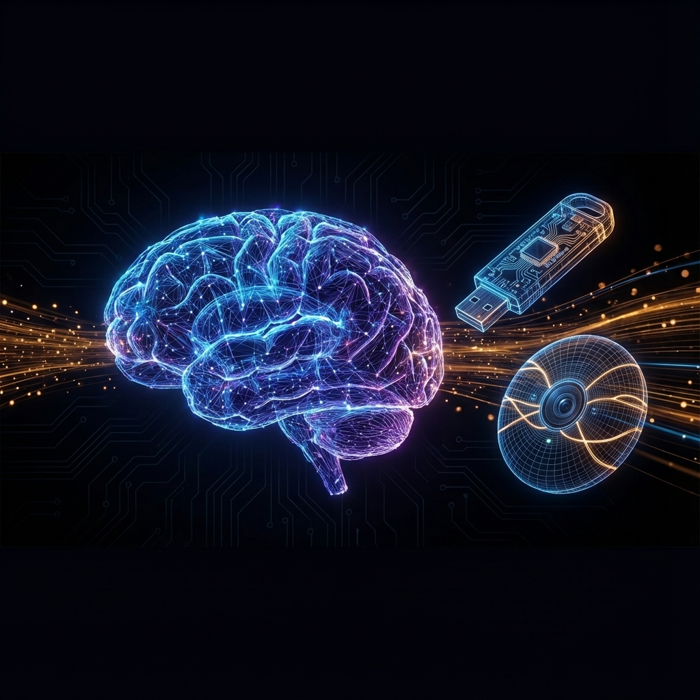
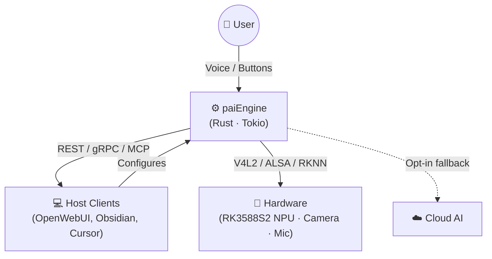

<div align="center">



# paiOS (Personal AI Operating System)

**The Open Source Operating System for Personal Intelligence.**

[](LICENSE)
[](apps/LICENSE-MIT)
[](https://github.com/aurintex/pai-os/actions)
[](https://docs.aurintex.com/)
[](https://discord.gg/7uSGGpRgK)
[](https://twitter.com/aurintex)

[Documentation](https://docs.aurintex.com/) • [Website](https://aurintex.com) • [Contributing](CONTRIBUTING.md)

</div>

---

## 🔮 The Vision

**paiOS** is more than just an operating system; it is the foundation for a new category of **Personal AI Hardware**.

Our mission is to build a privacy-first "Second Brain" that lives with you, understands your context, and operates independently of the cloud. We believe your intelligence should belong to you-running on trusted hardware, physically under your control.

To achieve this, we are building a unified, modular OS that powers multiple form factors, starting with **paiLink** (Portable AI Server) and evolving into **paiGo** (standalone AI Wearable).

## ⚡️ Form Factors

paiOS is designed to run on diverse hardware, bringing local intelligence to where you need it most.

### 1. paiLink (Your Local AI Server)
*Currently in Development*

A powerful Portable AI Server (based on the **Radxa Rock 5C**) that connects via USB and acts as a **private AI backend** for your existing tools.

**The Idea:** Plug it in, and any app that supports [Ollama](https://ollama.com) (or a compatible API) can use paiOS for inference. Your data stays on the device – no cloud required.

**Compatible Apps (Examples):**
*   **Coding:** VS Code (Continue, CodeGPT), Zed, Neovim
*   **Writing:** Obsidian, LibreOffice, OnlyOffice
*   **Chat:** Open WebUI, Lobe Chat

**Key Features:**
*   🔌 **Standard API:** Ollama-compatible endpoint for seamless integration.
*   🔒 **Air-Gapped Privacy:** Inference happens on the Portable AI Server, never in the cloud.
*   ⚡ **Hardware Acceleration:** NPU/GPU powered for real-time responses.

### 2. paiGo (The AI Wearable)
*The North Star*

The evolution of paiLink into a standalone, battery-powered AI wearable. It includes **all capabilities of paiLink** (local AI server, Ollama-compatible API) *plus* integrated sensors for contextual awareness.

Equipped with a camera and microphone array, it passively captures context to answer questions like *"Where did I leave my keys?"* or *"What was the action item from that meeting?"*.

**Everything paiLink can do, plus:**
*   📷 **Vision:** Onboard camera for multimodal AI (Vision-Language models).
*   🎙️ **Always-On Audio:** Continuous, private voice capture.
*   🔋 **Standalone:** No phone or PC required – works independently.
*   🧠 **Contextual Memory:** "What did I discuss with Sarah last Tuesday?"

---

## 🆚 Why paiOS?

| Feature | ☁️ Cloud AI (SaaS) | 🔐 paiOS (Local) |
| :--- | :--- | :--- |
| **Privacy** | Your data trains their models. | Your data never leaves the device. |
| **Ownership** | Renting intelligence (Subscription). | Owning the intelligence (One-off). |
| **Latency** | Network dependency (>500ms). | Real-time Neural Engine (<100ms). |
| **Usage** | Pay per token / Rate limits. | **Unlimited.** Use it as much as you want. |
| **Trust** | "Trust us, we're compliant." | "Verify it yourself." (Open Source). |

---

## 🗺️ Roadmap

We are currently in **Phase 0 (Foundation)**.

*   **Phase 0: Foundation:** Groundwork, Architecture Definitions, CI/CD, and Documentation infrastructure.
*   **Phase 1: paiLink:** Launching the Portable AI Server in **Developer** (Radxa Rock 5C) and **Professional** (Aluminum Case) editions.
*   **Phase 2: paiGo:** Evolution into a standalone, multimodal AI Wearable.

👉 [**View Detailed Roadmap**](https://docs.aurintex.com/roadmap/)

---

## 🏗️ Architecture & Tech Stack

paiOS is built on **Hexagonal Architecture** (Ports and Adapters) to ensure that the core logic ("The Brain") is completely decoupled from the specific hardware it runs on. This allows `paiOS` to run on paiLink today and paiGo tomorrow.

### The Stack

*   **Language:** **Rust** (Safety, Performance, Concurrency)
*   **Build System:** **Debos** (Reproducible, immutable Debian-based OS images)
*   **Documentation:** **Starlight** (Modern, accessible, version-controlled)

### System Design


```mermaid
graph TD
    User(("👤 User")) -- "Voice / Buttons" --> Engine
    Engine["⚙️ paiEngine\n(Rust · Tokio)"] -- "REST / gRPC / MCP" --> Clients
    Clients["💻 Host Clients\n(OpenWebUI, Obsidian, Cursor)"] -- "Configures" --> Engine
    Engine -- "V4L2 / ALSA / RKNN" --> HW["🔧 Hardware\n(RK3588S2 NPU · Camera · Mic)"]
    Engine -. "Opt-in fallback" .-> Cloud["☁️ Cloud AI"]
```

*   **Hexagonal Architecture:** The engine core (domain) is fully decoupled from hardware via Rust traits (ports). Adapters implement those traits — swap hardware without touching business logic.
*   **Security by Design:** Hardware access (camera, microphone, NPU) is designed to flow through `paiEngine`, where policy and permission checks are centralized. This helps ensure recording behavior is user-controlled.
*   **Platform Flexibility:** `paiEngine` is a flexible API platform. For wearables (paiGo), the smartphone app (paiApp) is the primary interface for configuration and interaction. Developers can build custom GUIs/HMIs on top via REST, gRPC, or MCP APIs.
*   **Single Source of Truth:** For deep dives into the architecture, see the **[Architecture Documentation](https://docs.aurintex.com/architecture/)**.

## 🏁 Quick Start for Developers

This is a monorepo containing the full stack. Dependencies include Rust (latest stable) and `debos`.

### 1. Build the Engine
```bash
cd engine
cargo build --release
# Run tests
cargo test
```

### 2. Build the OS Image
*Requires Docker*
```bash
# 1. Build the pai-engine .deb (placeholder binary by default)
bash os/packaging/build-deb.sh

# 2. Build the image via the godebos/debos container
docker run --rm \
  -v "$(pwd):/build" -w /build \
  --cap-add SYS_ADMIN \
  godebos/debos \
  --disable-fakemachine -t machine:radxa-rock5c os/image.yaml
```

> **Note:** For flashing instructions, hardware targets, and the full OS build guide, see the [Documentation](https://docs.aurintex.com/architecture/operating-system/).

## 🤝 Contributing

We are building the user-centric, privacy-first alternative to Big Tech AI.

1.  Check the [Contributing Guide](CONTRIBUTING.md).
2.  Pick an issue from [GitHub Issues](https://github.com/aurintex/pai-os/issues).
3.  **Sign our CLA** (one-time) - the CLAassistant bot will guide you.

## 📜 License

*   **Engine & OS:** [GNU AGPL v3](LICENSE) (Viral Open Source)
*   **Apps & SDK:** [MIT](apps/LICENSE-MIT) (Ecosystem Friendly)
