import { Aside } from '@astrojs/starlight/components';

## Status

**Accepted** (2026-01-15)

## Context

paiOS is a commercial open-source project that needs to:

1. **Protect the core runtime** from being forked without contributing back
2. **Allow proprietary extensions** for any developer or commercial partner
3. **Ensure long-term sustainability** – flexibility for future business models
4. **Maintain simplicity** – avoid "Qt licensing pain"

The runtime communicates with extensions via **gRPC over Unix Domain Sockets (IPC)**, similar to how Linux kernel syscalls create a boundary between the GPL kernel and user-space applications.

## Decision

We adopt a **"Default AGPL, with Permissive Exceptions"** model:

*   **Default:** All files are licensed under **AGPL-3.0** (per root `LICENSE` file).
*   **Exception:** Subdirectories with their own `LICENSE` file override the default.

```
pai-os/
├── LICENSE              (AGPL-3.0 = default for everything)
├── NOTICE               (Copyright & Trademarks)
│
│   ✅ FREE TO USE (Apache-2.0)
├── api/                 ← All API definitions
│   └── grpc/
├── apps/                ← Your extensions go here
│
│   🔒 MUST SHARE CHANGES (AGPL-3.0)
├── engine/              ← Runtime code
├── os/
├── scripts/
└── docs/
```

### Contributor License Agreement (CLA)

We require a CLA (replacing DCO) to grant aurintex the right to:
- **Ensure long-term sustainability** – flexibility for future business models
- Maintain the project indefinitely with proper resources
- Protect the project's right to defend its trademarks

### IPC Boundary as License Boundary

The gRPC/UDS communication between runtime and extensions creates a clear **process separation**:

```mermaid
flowchart TB
    subgraph ext["✅ Your Extension"]
        ext_label["Any license you want!<br/>Proprietary, MIT, Apache, closed..."]
    end
    
    ext -->|"gRPC over UDS<br/>(License Boundary)"| runtime
    
    subgraph runtime["🔒 paiOS Runtime"]
        runtime_label["AGPL-3.0"]
    end
    
    style ext fill:#1a4d1a,stroke:#4ade80,color:#fff
    style ext_label fill:#1a4d1a,stroke:#4ade80,color:#fff
```



This follows the same pattern as:
- **Linux Kernel (GPL)** + User-space apps (any license)
- **Docker Engine (Apache-2.0)** + Plugins (any license)

### Shared Memory Constraint

<Aside type="caution" title="License Boundary Warning">
The [FSF considers](https://www.gnu.org/licenses/gpl-faq.html#GPLPlugins) shared memory with complex data structures as equivalent to dynamic linking.
</Aside>

**Rule:** Shared memory may only be used for raw byte buffers (images, audio PCM). Control signals and handles must go through gRPC.

## Consequences

### Positive

- ✅ Clear separation: Runtime protected, extensions open
- ✅ B2B customers can write proprietary extensions
- ✅ Apache-2.0 provides patent protection for extension developers
- ✅ CLA enables future business model flexibility
- ✅ Simple: Only 2 licenses to understand

### Negative

- ⚠️ AGPL may deter some enterprise adopters (but this is intentional)
- ⚠️ CLA adds friction for contributors (mitigated by CLAassistant)

## Related

- [Licensing Guide](/guides/licensing) – Practical FAQ for extension developers
- [NOTICE file](https://github.com/aurintex/pai-os/blob/main/NOTICE) – Copyright and trademarks
