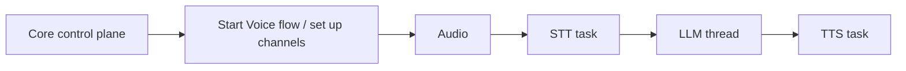

import { Aside } from '@astrojs/starlight/components';
import Mermaid from '../../../../components/Mermaid.astro';
import ExcalidrawViewer from '../../../../components/ExcalidrawViewer.astro';

## Status

**Accepted** (2025-03-01)

## Context

paiOS is designed to power **Personal AI Hardware** across multiple form factors: from **paiBox** (Private AI Server) to future wearable devices. This requires an architecture that is:

1. **Hardware-agnostic**: The same core logic must run on different silicon (Rockchip, NVIDIA, Apple Silicon)
2. **Privacy-first**: Users must be able to **trust** what has access to sensors
3. **UX-friendly**: Users should be able to use standard GGUF models without complex conversion pipelines
4. **Efficient**: Embedded devices have limited RAM; we cannot afford microservice overhead

### Trust, Not Just Privacy

Inspired by Android's permission model, we ensure that apps and AI models cannot access hardware (camera, microphone, NPU) without explicit user permission. All hardware access goes through a single trust boundary, giving users real control over their data.

### The Core Challenge

The RK3588 SoC offers heterogeneous compute resources:

| Resource | Capability | Trade-off |
|----------|------------|-----------|
| **NPU** | 6 TOPS, high throughput | Requires proprietary `.rknn` format (vendor lock-in) |
| **GPU** | Mali-G610, parallel compute | Lower throughput than NPU |
| **CPU** | Cortex A76/A55, ARM NEON | Flexible but slower for matrix ops |

The challenge: How do we leverage all three resources efficiently while maintaining a simple, portable architecture?

### Key Constraints

- **Embedded RAM**: Single-process architecture preferred over microservices
- **Inference flexibility**: The system must offer multiple ways to run models: lightweight CPU-friendly options (e.g. GGUF via llama.cpp) for quick testing without proprietary conversion; fully hardware-optimized backends (e.g. RKNN) for best performance; and the ability to mix backends for parallel workloads (heterogeneous compute).
- **Security**: All hardware access must go through a single trust boundary
- **Maintainability**: Contributors and agents must immediately understand which **domain** they work in (e.g. Vision, Inference) and, within that, which **hexagonal layer** (domain logic, ports, or adapters).

### Documentation Approach

We document the **paiOS Engine architecture** using the **C4 Model**:
- **Level 1 (Context)**: System context showing paiOS's relationships with external actors (users, apps, hardware)
- **Level 2 (Container)**: Container diagram showing the paiEngine process and its interactions
- **Level 3 (Component)**: Component diagram zooming into the pai-engine container (Hexagonal view: driving/driven, engine domains)

See [C4 Architecture](/architecture/c4-architecture/) for system-level diagrams (including Level 3) and [OS & Infrastructure](/architecture/operating-system/) for the OS/hardware layer. This ADR focuses on the **"why"** behind the **Engine's** architectural decisions; the C4 diagrams show the **"what"** at different abstraction levels. For detailed implementation of each domain, see [Engine Domains](/architecture/modules/).

## Decision

We adopt a **Modular Monolith** architecture using **Hexagonal Architecture** (Ports and Adapters) combined with a **Hybrid Inference Strategy** that distributes workloads across NPU, CPU, and GPU.

### 1. Architectural Style: Modular Monolith

paiEngine is a **single executable** compiled from a single monorepo with clear module boundaries. No microservices.

**Why Modular Monolith over Microservices?** On embedded devices with limited RAM:
- **Lower overhead**: Single process = fewer context switches, shared memory, simpler lifecycle
- **Faster startup**: No inter-process communication or service discovery
- **Simpler security**: Single trust boundary, easier permission model
- **Better resource utilization**: Shared memory pools, unified resource management

The modularity comes from **strict architectural boundaries** (domain vs adapters) enforced by Rust's module system and workspace structure, not from separate processes.

### 2. Hexagonal Architecture (Ports and Adapters)

We adopt **Hexagonal Architecture** because it is:
- **Rust-native**: [Rust traits](https://doc.rust-lang.org/book/ch10-02-traits.html) map directly to ports/adapters
- **Embedded alignment**: [Embedded Rust Book](https://doc.rust-lang.org/beta/embedded-book/design-patterns/hal/) and [embedded-hal](https://docs.rust-embedded.org/book/portability/) use traits as abstraction boundaries: the same idea as ports and adapters
- **Pragmatic**: Simpler than full Clean Architecture, ideal for MVP
- **Zero overhead**: Compile-time polymorphism

**Core principle:** The **Core (Domain)** defines **Ports** (Rust traits); the **Edge (Adapters)** implements them. Dependencies point **inwards**; `main.rs` is the [**Composition Root**](/architecture/composition-root/) that wires adapters into the domain at startup.

**SoC Vendor Independence & Rapid Porting:**
While the Rockchip RK3588 is the first SoC supported by paiOS, the architecture is explicitly designed to prevent vendor lock-in. By isolating hardware-specific SDKs (like Rockchip's RKNN or librga) into interchangeable Adapters, the entire engine can be rapidly ported to new SoCs (e.g., NVIDIA Jetson, Snapdragon, or Apple Silicon) simply by writing new adapters for the existing Ports. The core logic remains completely untouched.

| Adapter Type | Direction | Examples |
|--------------|-----------|----------|
| **Driving Adapters** (Left) | Inbound → Domain | gRPC API Gateway, HMI (buttons), CLI |
| **Driven Adapters** (Right) | Domain → Outbound | Camera, Microphone, NPU, Storage |

For detailed component implementations, see the individual domain pages:
- [Core](/architecture/modules/core/): Orchestrator, SessionManager, FlowRunner
- [Audio](/architecture/modules/audio/): Audio capture, playback, signal conditioning
- [Vision](/architecture/modules/vision/): Camera, frame processing, motion gating
- [Inference](/architecture/modules/inference/): AI backends, resource management, MCP client
- [API](/architecture/modules/api/): API Gateway, protocol adapters, routing
- [Peripherals](/architecture/modules/peripherals/): HMI, buttons, LEDs, haptics, USB keyboard emulation

### 3. Rust Workspace (Summary)

We enforce architectural boundaries using a **Cargo workspace** under **`engine/`**: domain crates (`common`, `core`, `vision`, `audio`, `inference`, `api`, `peripherals`) each contain domain logic, ports (traits), and feature-gated adapters; adapters live **inside** their domain crate, not in separate top-level crates; domain crates never import each other (cross-domain coordination goes through `core`); and **`pai-engine`** is the only executable and the Composition Root.

For the full workspace layout, feature flags, capability vs profile features, and the sys-crate pattern, see [ADR-008: Workspace Layout](./008-workspace-architecture) and [Workspace and Build](/architecture/workspace-and-build/).

### 4. Hybrid Inference Strategy

We distribute workloads based on their characteristics:

| Resource | Workload | Rationale |
|----------|----------|-----------|
| **NPU** | Main LLM (Llama, Mistral, Qwen) | Highest throughput, primary inference |
| **CPU** | Speech-to-Text (Whisper), VAD, Wake Word | ARM NEON optimized, saves NPU memory |
| **CPU** | Vector Database (RAG) | SIMD benefits, fast RAM access |
| **GPU** | Small logic models (classifiers) | Parallel aux tasks, avoids NPU context switch |

**Inference paths we offer:** [GGUF](/glossary/#g) via **upstream** llama.cpp gives a user-friendly path (no proprietary conversion, [CPU](/glossary/#c)/[GPU](/glossary/#g) fallback) for [LLM](/glossary/#l)s and quick testing; we use llama.cpp in **CPU-only** mode (no dependency on community forks). [RKNN](/glossary/#r)/[RKLLM](/glossary/#r) provide [NPU](/glossary/#n)-optimized vision and language models; ONNX (e.g. Sherpa-ONNX for audio: wake word, [STT](/glossary/#s), [TTS](/glossary/#t), [VAD](/glossary/#v)) covers small, portable models. Further adapters ([MCP](/glossary/#m) client, mock) and backends can be added behind the same port traits. The architecture allows mixing backends for parallel workloads. All are encapsulated behind Rust port traits.

See [Inference](/architecture/modules/inference/) for the full adapter table, resource management, and hardware allocation strategy.

### 5. Runtime & Concurrency Model

We use a **Mono-Daemon** architecture with a clear separation between async I/O and blocking compute:

#### When to use what

| Primitive | When to use | Examples |
|-----------|-------------|---------|
| **`std::thread`** | Long-lived, blocking, or CPU-bound work that must not block the Tokio event loop. Each thread owns its resources and communicates via channels. | Dedicated inference thread (NPU/GPU driver calls are blocking FFI); camera capture thread (V4L2 `ioctl` blocks). |
| **Tokio task** (`tokio::spawn`) | I/O-bound, async work that benefits from cooperative scheduling. Use for anything that `await`s network, file, or timer futures. | gRPC/REST request handlers; MCP server/client; EventBus dispatch; health checks; scheduled timers. |
| **`tokio::task::spawn_blocking`** | Short-lived, blocking work that doesn't justify a dedicated thread. Tokio runs it on a thread pool and returns a future. | One-off config file parsing; SQLite permission lookups; model file validation before loading. |

<Aside type="tip">
Inference is "compute-bound" and blocking. Running it in the tokio event loop would cause the entire server to freeze during generation ("starvation"). Dedicated OS threads prevent this.
</Aside>

#### Communication between threads and tasks

| Mechanism | Use case | Details |
|-----------|----------|---------|
| **Bounded `tokio::sync::mpsc`** | Primary channel between Tokio tasks and between Tokio tasks and `std::thread`s. | Sender can be passed to a `std::thread`; receiver lives in a Tokio task (or vice versa). Always bounded to enforce backpressure. |
| **`tokio::sync::broadcast`** | One-to-many event distribution (EventBus). | The `EventBus` is a broadcast channel: when Audio detects a wake word or Peripherals registers a button press, the event is broadcast to all subscribers (SessionManager, active Flows). Bounded; slow receivers miss events (acceptable: missed events are logged, not queued indefinitely). |
| **`tokio::sync::oneshot`** | Single request → single response. | Used when the Core sends a command to an inference thread and waits for the result (e.g., "generate text" → generated text). |
| **Shared state (`Arc<Mutex<_>>` / `Arc<RwLock<_>>`)** | Configuration and session state that is read often, written rarely. | `SessionConfig`, `PermissionManager` cache. Prefer `RwLock` for read-heavy access. Avoid holding locks across `.await` points (use `tokio::sync::RwLock` if unavoidable, but prefer channels). |

#### Control vs Data plane

The Core orchestrates **setup and teardown** of pipelines (control plane). Once a pipeline is running, **data flows directly** between domains via bounded channels without routing every frame through the SessionManager:

The Core holds the channel handles and can tear down the pipeline (close senders, cancel tasks) at any time; this is the Saga rollback mechanism. But while the pipeline runs, data moves point-to-point for efficiency.

### 6. Sys-Crate Pattern

All `unsafe` and FFI code lives in **sys-crates** under `libs/`. The **domain crates** never depend on them; only **adapters** (inside domain crates) do.

**Benefits:** Clear unsafe boundary, domain testability, backend swappability, feature isolation.

See [Workspace and Build](/architecture/workspace-and-build/) for full details on the sys-crate pattern and its relationship to adapters.

### 7. API Gateway & Security Architecture

The `api` crate serves as the **primary ingress point** (Driving Adapter). It enforces **strict, hardcoded routing rules** that prevent "Confused Deputy" attacks:

| Adapter | Accessible Ports | Restricted |
|---------|------------------|------------|
| **LocalSystem** (UDS/IPC) | ALL ports | None |
| **SecureNetwork** (gRPC TCP) | Inference, SensorRelay, SessionConfig | `DeviceControlPort` |
| **McpServer** (MCP) | Inference, SensorRelay, SessionConfig | `DeviceControlPort` |
| **Ollama/OpenAI** (HTTP) | Inference only | All others |

The **Permission System** ([HITL](/glossary/#h)) adds a second layer: sensitive actions require **physical button press** on the device for confirmation, even if the adapter has port access.

See [API](/architecture/modules/api/) for gateway details and [Security Architecture](/architecture/security/) for the full security model.

### 8. MCP Integration (Bidirectional)

paiOS uses MCP in **two directions**:

| Role | Feature | Purpose |
|------|---------|---------|
| **MCP Server** (`api_mcp_server`) | Allows host PCs to use the [AI device](/glossary/#a) as a remote sensor/tool |
| **MCP Client** (`infer_mcp_client`) | Allows the device's [LLM](/glossary/#l) to use external tools (Home Assistant, memory, web search) |

**Key principle:** The LLM never executes tools directly. It generates structured JSON tool-calls that are routed through the `ToolExecutionPort` to external MCP servers, gated by the PermissionManager.

See [Inference](/architecture/modules/inference/#mcp-client-and-tool-execution) for the MCP client architecture.

### 9. App–Engine Topology

The engine is always the **server**; clients connect to it. The topology varies by form factor, but the architecture is the same:

| Scenario | Client | Transport | Profile notes |
|----------|--------|-----------|---------------|
| **paiBox (AI Server)** | Host PC (Claude Desktop, CLI, IDE) | gRPC UDS (same device) or MCP (stdio/SSE) | Primary use case for Milestone 0–2. The engine runs on the device; the host PC is the client. |
| **Standalone Wearable (future)** | The device itself (voice/buttons) | In-process (`PeripheralsInterface`) | Agentic: the user talks to the device, the engine runs the full pipeline locally. No external client required. |
| **Companion App (Smartphone)** | Smartphone app | gRPC TCP/TLS over WiFi/BT | The app is just another remote client, subject to the same routing matrix. No architecture change. |
| **GUI (Desktop)** | Local desktop app | gRPC UDS or REST | See [API: GUI / Companion App](/architecture/modules/api/#architecture-context--relationships). |

**"Direct vs overlay":** A smartphone companion app that sits "on top" of the engine is not an overlay layer; it's a standard API client connecting via gRPC TCP. The engine remains the single backend.

**Agentic angle:** When the primary interaction is "user talks to one model" (engine as autonomous backend), the engine handles the full voice pipeline locally. External clients (phone, PC) are optional; they can configure or monitor, but the engine operates independently. This is already supported by the existing architecture: `PeripheralsInterface` drives the engine locally, API adapters enable optional remote access.

**Disabling remote APIs:** If a build should have no network API (e.g. minimal embedded, no TCP), simply omit `api_grpc_tcp` from the profile. The engine still works via local IPC (`api_grpc_uds`) and direct peripheral interaction.

### 10. Simplification Review (YAGNI)

We reviewed the architecture for over-engineering. Decisions:

| Area | Decision | Rationale |
|------|----------|-----------|
| **Port count (4 capability ports)** | Keep all four (`DeviceControlPort`, `SessionConfigPort`, `SensorRelayPort`, `InferencePort`) | Merging ports (e.g. SessionConfig + SensorRelay into one "ControlPort") would weaken the routing matrix; each port is a distinct security boundary. |
| **Crate count (7 domain crates)** | Keep all seven, but implement incrementally | The crate boundaries enforce Hexagonal Architecture at compile time. For Milestone 0, only `common`, `core`, `inference`, `api`, and `pai-engine` need code; the rest can be stubs with ports defined and mock adapters only. |
| **Build profiles** | Keep `desktop` / `target` / `test` only | No additional profiles unless a concrete new board requires one. Avoid premature `profile_*` variants. |
| **FlowRunner abstraction** | Keep the trait, implement only `HardcodedFlowRunner` for MVP | The trait is one file; the cost is near zero; the value (future extensibility) is high. No scripting runtime in MVP. |
| **Composition root** | Keep single `main.rs`; extract a `composition` module only if `main.rs` exceeds ~300 lines | See [Composition Root](/architecture/composition-root/). |
| **Module merging** | Do not merge crates (e.g. API into Core) | Blurs domain boundaries and makes the routing matrix harder to audit. |

### 11. Future Scope & Deferred Features (YAGNI)

Features intentionally excluded from the MVP, with architectural readiness:

| Feature | Why Deferred | How Architecture Supports It |
|---------|-------------|------------------------------|
| **Dynamic / User-Defined Flows** | Static, strongly-typed Rust flows (`flows::Voice`, `flows::Chat`) are faster to implement, fully testable, and sufficient for MVP. The long-term vision: **users defining their own personalised flows individually** (e.g. custom transcription pipelines, night-vision alerts, interview prep sessions) and requires a scripting/agentic runtime that is out of scope for the initial release. | `SessionManager` abstracts all flow execution behind the `FlowRunner` trait. A `ScriptedFlowAdapter` (Rhai), `AgenticFlowAdapter` (LangGraph), or a JSON/YAML DSL adapter can be injected at startup without any Core changes. See [Core: MVP Flows & FlowRunner](/architecture/modules/core/#mvp-flows-flows-module). |
| **Native Local Vector DB** | Consumes precious RAM/Storage on the embedded device | MCP-based memory today; `LocalMemoryAdapter` (SQLite-VSS or Qdrant-embedded) in `inference` later |
| **BLE Provisioning & OpenThread** | Massive complexity for MVP | New Driving Adapter in API Gateway (`api_ble_provisioning`); no Core changes needed |

### 12. Cross-Cutting Robustness Guarantees

The following patterns are **required** across **all** domain crates. They were explicitly identified during the architecture design phase as critical for production reliability. Violating any of these will cause crashes, Zombie States, or corrupted session flows.

| Pattern | Requirement | Applies To |
|---------|-------------|------------|
| **Bounded Contexts** | No direct cross-domain imports. All inter-domain coordination goes through `core`. | All domain crates |
| **Cancellation Safety** | Every domain crate that holds hardware resources must expose clean `stop_*()` / `cancel_*()` methods that are safe to call at any time. Core invokes these during Saga rollback. | `audio`, `vision`, `inference` |
| **Saga / Rollback** | Multi-step flows (`Voice`, `Stream`) are Sagas: each step registers a compensating action. On interrupt or error, compensating actions execute in reverse order, guaranteeing no Zombie States. | `core` flows + all domain crates |
| **Idempotency** | State-changing operations (start recording, load model) must be idempotent. Duplicate requests return `AlreadyInProgress`, not an error or a second parallel operation. | `core`, `api` |
| **Backpressure & Bounded Queues** | All internal Tokio channels and data pools (FramePool, RingBuffer) use **bounded capacities**. When full, old data is dropped. OOM is never acceptable. | `vision`, `audio`, `inference` |

See [Core: Production-Grade Robustness](/architecture/modules/core/#production-grade-robustness) for the canonical reference implementation of these patterns.

### 13. Scope and Completeness Check

We compared the architecture against typical Edge-AI and embedded-agent systems to identify critical gaps. Status of each component:

| Component | Status | Where |
|-----------|--------|-------|
| **Observability (logs, metrics, tracing)** | Partially covered | `Logger` in `common`; structured tracing (e.g. `tracing` crate with spans) not yet specified. **Recommendation:** adopt `tracing` from day one; add a `tracing` subscriber in `main.rs`. Metrics and trace export (e.g. OpenTelemetry) deferred. |
| **OTA / Update system** | Covered | [ADR-003](/architecture/adr/003-update-system/) (A/B partitioning). |
| **Secure boot / attestation** | Out of scope for MVP | Depends on hardware support; document as deferred. |
| **Key storage / secrets** | Not covered | No secrets management specified. For MVP, API keys (if any) can live in config; for production, integrate with Linux keyring or a hardware-backed store. **Add as a deferred item.** |
| **Time / sync (NTP, RTC)** | Implicit | Handled by the host OS (Linux NTP). No engine-level concern unless offline operation requires monotonic timestamps. |
| **Power / battery** | Covered | `SystemStatus` port in Core, `SystemMonitorAdapter`. |
| **Recovery / safe mode** | Partially covered | A/B partitioning (ADR-003) provides rollback. A dedicated "safe mode" (minimal boot with diagnostics only) is not yet specified. **Add as a deferred item.** |
| **Health / diagnostics endpoint** | Not covered | A `/health` or similar endpoint for monitoring (e.g. companion app checking if the engine is alive) is missing. **Recommendation:** add a basic health check to the API gateway (always enabled, no authentication, returns engine state and uptime). |
| **Graceful shutdown** | Not covered in docs | See [ADR-008 Improvement Checklist](/architecture/adr/008-workspace-architecture/#rust--workspace-improvement-checklist): startup/shutdown lifecycle is tracked there. |
| **Cross-domain data flow** | Partially covered | Documented in this ADR under [Runtime & Concurrency](#5-runtime--concurrency-model) (control vs data plane). |

**Nothing critical was found missing.** The main gaps (structured tracing, health endpoint, graceful shutdown, secrets management) are important for production readiness but do not require architectural changes; they fit cleanly into the existing structure.

## Rationale

### Why Hexagonal over unstructured Monolith?

- **Contributors** immediately see which **domain** they work in and which **hexagonal layer** (domain vs adapters) they touch.
- **Testability**: The domain can be tested without hardware (mock adapters)
- **Portability**: The same domain runs on paiBox today and on future wearable devices tomorrow

### Why distribute across NPU/CPU/GPU?

Using only the NPU creates bottlenecks. By distributing workloads, we achieve true parallelism without expensive context switches.

### Why Modular Monolith instead of Microservices?

Single process = fewer context switches, shared memory, simpler lifecycle, faster startup, better resource utilization on embedded devices. Modularity from Rust's module system, not separate processes.

### Why Sys-Crates instead of inline unsafe?

- **Auditability**: All unsafe code in one place
- **Vendor SDK integration**: Rockchip RKNN SDK requires C bindings
- **Future-proofing**: When better Rust-native alternatives emerge, we swap the sys-crate

## Alternatives Considered

### Architectural Style Alternatives (Final Review)

Before comparing specific technology choices, we evaluated the overarching **architectural style**. This section records that review to close the question definitively.

| Style | Strengths for paiOS | Weaknesses for paiOS | Verdict |
|-------|---------------------|----------------------|---------|
| **Hexagonal (Ports & Adapters)** | Rust traits = ports (zero-cost); embedded-hal alignment; single composition root; adapters are naturally feature-gated; domain logic testable without hardware | Indirection grows with the number of ports; can feel like "boilerplate" for small projects | **Chosen** |
| **Layered / Clean Architecture** | Well-documented in literature; strict dependency rule | More layers than needed (entities, use cases, interface adapters, frameworks); the extra layers add ceremony without benefit for a monolith where traits already enforce boundaries | Rejected |
| **Vertical Slices** (by feature/flow) | Good for teams owning entire features end-to-end; reduces cross-cutting coordination | Doesn't naturally express hardware abstraction (a camera adapter isn't a "feature"); harder to share ports across slices; would duplicate infrastructure in each slice | Rejected |
| **Actor Model** (message-passing components) | Natural concurrency model; each actor is independently testable | Complex in Rust (ownership + message-passing friction); harder to reason about synchronous orchestration (Sagas, rollback); actor frameworks add weight | Not chosen as primary; the EventBus and channel-based communication borrow *ideas* from actors without the full framework |
| **HAL-only** (embedded-hal traits, no orchestration layer) | Minimal overhead; proven in bare-metal Rust | Too narrow: covers hardware abstraction but doesn't address orchestration, session management, API routing, or security; paiOS is an *OS-level daemon*, not a bare-metal driver | Rejected as sole pattern; embedded-hal *concepts* are used within adapters |

**Conclusion: keep Hexagonal:**

1. **Natural Rust fit.** Traits are ports; structs are adapters; `#[cfg(feature)]` gates adapters at compile time. No runtime framework needed.
2. **Embedded-HAL alignment.** The embedded Rust ecosystem already uses this pattern (trait = abstraction boundary). Contributors with embedded Rust experience feel at home.
3. **Single composition root.** One place (`main.rs`) wires everything; the rest of the codebase is hardware-agnostic and testable.
4. **Scaling path.** If the project grows: keep one composition root, optionally split it into a `composition/` module (see [Composition Root](/architecture/composition-root/)); new domains become new crates with the same `domain/ports/adapters` layout. No structural redesign needed.
5. **Agent-native angle.** Ports are stable API boundaries; MCP and external agents are modeled as driving adapters. Agent-parity is maintained at the port level without special-casing.

**Risk to watch:** As the number of ports grows, the Orchestrator's type signature can become unwieldy (currently 7 generic parameters). Mitigations: use a type-family / associated-type bundle to reduce parameters, or use `Box<dyn Trait>` for orchestration-level ports where vtable cost is negligible.

### Technology-Specific Alternatives

| Alternative | Why Not Chosen |
|-------------|----------------|
| **Native RKNN only** | Vendor lock-in, requires Python conversion, no CPU fallback |
| **NPU for all inference** | Bottleneck when multiple models needed simultaneously |
| **Microservices architecture** | Too much RAM/IPC overhead on embedded devices |
| **Direct hardware access (no HAL)** | Security risk, no permission control, not portable |
| **Pure Safe Rust (no sys-crates)** | Impractical: vendor SDKs require FFI bindings |
| **Shared memory for IPC** | License implications (see [ADR-001](./001-licensing-strategy)), complex lifecycle |

## Consequences

### Positive

- **Hardware-agnostic core** enables multi-form-factor support (server → wearable)
- **Clear boundaries** help contributors understand the architecture
- **Security auditable**: all unsafe code isolated in sys-crates
- **UX-friendly**: GGUF models work out of the box
- **Parallel inference**: NPU handles LLM while GPU runs auxiliary tasks

### Negative

- **llama.cpp scope**: We use upstream llama.cpp in **CPU-only** mode; we do **not** depend on the `rk-llama.cpp` community fork (which adds flexible NPU/CPU inference and fallback when ops are unsupported on the Rockchip NPU). If that fork is merged upstream, we benefit from improved flexibility and robustness, but our design does not require it.
- **Complexity**: Three inference backends add maintenance burden
- **Trait abstraction overhead**: Minimal performance impact, but exists

### Mitigation

| Risk | Mitigation Strategy |
|------|---------------------|
| llama.cpp backend | Upstream llama.cpp, CPU-only; Rust traits allow backend swap if we add NPU via llama.cpp later |
| Backend complexity | Strict domain separation; use established crates (`whisper-rs`, `llama-cpp-2`) |
| Unsafe code risks | Isolated in sys-crates; regular security audits |

## Architecture Diagram

<ExcalidrawViewer src="/images/Architecture/system-architecture.excalidraw" height={640} />

For detailed visualizations, see:
- [C4 Architecture](/architecture/c4-architecture/): System Context and Container diagrams
- [OS & Infrastructure](/architecture/operating-system/): Full layer stack with technology table

## Related

- [ADR-001: Licensing Strategy](./001-licensing-strategy): IPC boundary as license boundary, shared memory constraints
- [ADR-002: OS Building Tool](./002-os-building-tool): Debos for reproducible image building
- [ADR-003: Update System](./003-update-system): A/B partitioning and OTA updates
- [OS & Infrastructure](/architecture/operating-system/): Detailed layer descriptions and technology stack
- [C4 Architecture](/architecture/c4-architecture/): Container and Component diagrams with data flows
- [Engine Domains](/architecture/modules/): Detailed domain documentation
- [Workspace and Build](/architecture/workspace-and-build/): Feature flags, sys-crate pattern, build configuration
- [Security Architecture](/architecture/security/): Permission system, port isolation, threat model
