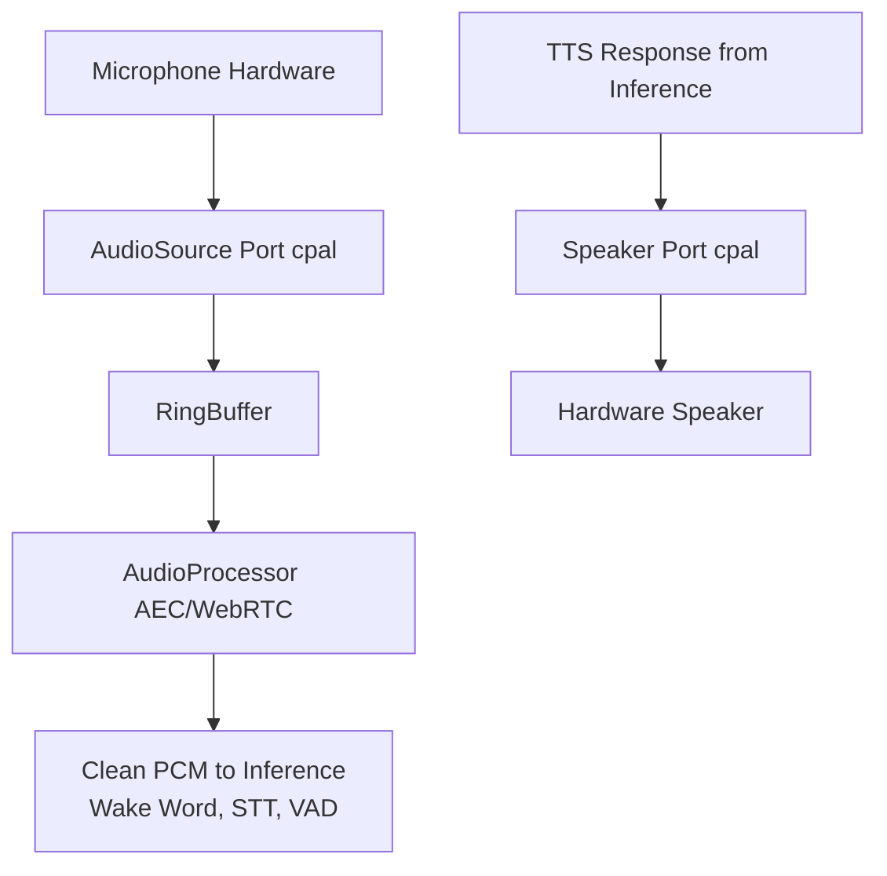

import { Aside } from '@astrojs/starlight/components';

## Overview

The `audio` crate is the **Driven Adapter** responsible for all audio capture and playback plumbing. It implements the Core's `AudioInterface` and exposes **ports** (traits) for microphones, speakers, and acoustic processing. It contains **no machine learning**; Wake Word, STT, and other audio ML live in [`inference`](/architecture/modules/inference/).

## Ports & Adapters (Feature Flags)

<table>
  <thead>
    <tr>
      <th scope="col">Adapter</th>
      <th scope="col">Implements Port(s)</th>
      <th scope="col">Capability Feature</th>
      <th scope="col">Technology / Purpose</th>
    </tr>
  </thead>
  <tbody>
    <tr>
      <td><a href="#1-audiosource-port--microphoneadapter"><code>MicrophoneAdapter</code></a></td>
      <td><a href="#1-audiosource-port--microphoneadapter"><code>AudioSource</code></a></td>
      <td rowspan="2"><code>audio_cpal</code></td>
      <td>CPAL → Cross-platform local audio capture</td>
    </tr>
    <tr>
      <td><a href="#2-speaker-port--speakeradapter"><code>SpeakerAdapter</code></a></td>
      <td><a href="#2-speaker-port--speakeradapter"><code>Speaker</code></a></td>
      <td>CPAL → Cross-platform local audio playback</td>
    </tr>
    <tr>
      <td><a href="#3-audioprocessor-port--webrtcadapter"><code>WebRtcAdapter</code></a></td>
      <td><a href="#3-audioprocessor-port--webrtcadapter"><code>AudioProcessor</code></a></td>
      <td><code>audio_webrtc</code></td>
      <td>WebRTC audio processing → Acoustic echo cancellation (AEC) and noise suppression before Inference</td>
    </tr>
    <tr>
      <td><a href="#4-mockadapter-test-double"><code>MockAdapter</code></a></td>
      <td><a href="#1-audiosource-port--microphoneadapter"><code>AudioSource</code></a>, <a href="#2-speaker-port--speakeradapter"><code>Speaker</code></a></td>
      <td><code>audio_mock</code></td>
      <td>Simulated audio capture/playback (and pipeline) for CI testing</td>
    </tr>
  </tbody>
</table>

<Aside type="note">
The `Capability Feature` column lists features defined on the `audio` crate. Profiles in `pai-engine` (such as `desktop`, `target`, and `test`) select which of these are active at build time. For a central overview of which audio capabilities each profile enables, see the **Feature Flag Matrix** in [Workspace and Build](/architecture/workspace-and-build/#feature-flag-matrix-capabilities-vs-profiles).
</Aside>

## Architecture Context / Relationships

The `audio` crate is driven by the `core` orchestrator. It receives commands to start or stop audio streams and provides clean PCM data that the core can then hand over to `inference` for Speech-to-Text or Wake Word detection.

## Crate Structure

Like other domain crates, `audio` clearly separates its audio processing logic from the hardware-specific implementations.

```text
crates/audio/
├── src/
│   ├── domain/               # AudioController, AudioProfile, RingBuffer
│   │   └── ports.rs          # Internal Traits: `AudioCapturePort`, `DspEnginePort`
│   ├── adapters/             # Hardware and OS implementations
│   │   ├── alsa.rs           # Linux ALSA capture
│   │   ├── cpal.rs           # Cross-platform audio (fallback/desktop)
│   │   └── dsp.rs            # Beamforming, AEC, Noise Suppression
│   └── lib.rs                # Implements Core's `AudioInterface`
└── Cargo.toml
```

## The "Dumb Plumbing" Philosophy

**Crucial distinction:** `audio` contains **absolutely zero machine learning**. Tasks such as Wake Word detection or Speech-to-Text are in `inference`. The Audio domain only handles:

- **Capture:** Pulling raw or processed PCM from the hardware (microphones)
- **Playback:** Pushing PCM (e.g., TTS output) to speakers or line-out
- **Buffering:** Lock-free ring buffer between capture and consumers (e.g., pre-roll for Wake Word); bounded to avoid OOM
- **Signal conditioning:** AEC and noise suppression **before** the stream is handed to Inference

**Why separate audio plumbing from ML:**
- **Testability:** Audio pipelines can be tested with mock hardware and inference
- **Portability:** Same plumbing (CPAL, WebRTC AEC) runs on x86, ARM, or mock
- **Resource boundaries:** Audio streaming is real-time; ML is batch-oriented
- **Single responsibility:** `audio` = "get clean PCM in and out"; `inference` = "run models on that PCM"

Sensors (microphones) and actuators (speakers) sit on the **Driven** side. The Core initiates audio streams and pulls data; hardware does not dictate control flow.

## Internal Domain Components

These match the architecture diagram: **`AudioManager`** contains **`AudioConfig`**, **`RingBuffer`**, and the ports **`AudioSource`**, **`Speaker`**, **`AudioProcessor`**, **`WakeWordDetector`**. The `WakeWordDetector` port is implemented in **inference** (see [Wake Word and the Interface](#wake-word-and-the-interface) in this section).

| Component | Responsibility |
|-----------|----------------|
| **`AudioManager`** | Central facade implementing `AudioInterface`. Orchestrates hardware adapters and exposes a single entry point for the SessionManager and voice flows. |
| **`AudioConfig`** | Hardware and pipeline constraints: sample rates (16 kHz for ML), channel count, buffer sizes. Ensures PCM format matches what Inference expects. |
| **`RingBuffer`** | Lock-free, safe cross-thread buffer for continuous PCM. Capture writes, Core/Inference reads; bounded capacity so overflow drops old samples instead of OOM. Provides pre-roll for Wake Word. |
| **`AudioSource`** | Port: supplies raw or processed PCM from the microphone(s) (`audio_in`). Implemented by e.g. CPAL/ALSA adapters. |
| **`Speaker`** | Port: outputs PCM (`audio_out`, e.g. TTS from Inference) to hardware (speakers / line-out). Implemented by e.g. CPAL adapter. |
| **`AudioProcessor`** | Port: AEC and noise suppression (e.g. WebRTC). Consumes capture/buffer and outputs clean `processed_audio` to Inference. |
| **`WakeWordDetector`** | Port: wake-word detection on PCM. **Implemented in inference** (e.g. Sherpa-ONNX); Audio only holds the port / passes stream to Core for Inference. |

### Wake Word and the Interface

**Wake Word Detection (WWD) is implemented in [`inference`](/architecture/modules/inference/)**, not in audio. The transcript and architecture clarify the flow:

1. **Audio** captures and conditions PCM (AEC, noise suppression, buffering) and hands **clean PCM** to the Core.
2. The **Core (SessionManager)** passes that stream to **inference**, where the `WakeWordDetector` port (e.g. Sherpa-ONNX) runs.
3. When a wake word is detected, **Inference** emits a **wake-word event** (e.g. `WWD_event`).
4. That event is delivered to the **Interface / Core** (e.g. via `EventBus` or an inference→core callback). The **SessionManager** then transitions session state (e.g. to `Listening` or `Recording`) and drives the rest of the voice pipeline (STT → LLM → TTS).

So audio never runs ML; it only provides the conditioned stream. The Core coordinates Audio and Inference and reacts to wake-word events from Inference.

### Cancellation-Safe Interface (Saga Rollback Support)

`audio` is a **participant in Core's Saga rollback**. When the `SessionManager` cancels an in-progress voice flow (e.g., the user interrupts while the system is responding), it issues compensating commands to Audio in a specific order. `AudioManager` **must** support clean cancellation at any point:

- `stop_capture()`: halts microphone input, flushes or discards the RingBuffer, releases the CPAL/ALSA device handle. Must be safe to call even if capture was never started.
- `stop_playback()`: halts TTS output mid-sentence via the Speaker port, does not block or wait for drain.

Failure to support these cleanly will leave the microphone open or the speaker playing after the Core has moved back to `Idle`, causing a Zombie State. See [Core: User-Interruption & State Rollback](/architecture/modules/core/#sessionmanager-the-kernel) for the full rollback sequence.

## Ports and Feature-Gated Adapters

### 1. `AudioSource` (Port) & `MicrophoneAdapter`

- **Responsibility:** Supplies raw or processed PCM from the microphone(s)
- **Implemented by:** `MicrophoneAdapter`, gated by `audio_cpal` (real hardware) or `audio_mock` (tests)
- **Technology:** Uses the **`cpal`** crate to pull raw audio from the hardware mic. On desktop and target builds, `audio_cpal` selects the concrete adapter; in CI the `audio_mock` feature provides a mock microphone implementation wired into the same port.

### 2. `Speaker` (Port) & `SpeakerAdapter`

- **Responsibility:** Outputs PCM (e.g., TTS) to the speaker or Bluetooth line-out
- **Implemented by:** `SpeakerAdapter`, gated by `audio_cpal` or `audio_mock`
- **Technology:** Uses **`cpal`** to push audio to the default output device. As with capture, `audio_cpal` selects the concrete adapter on desktop/target and `audio_mock` swaps in a mock speaker for tests.

### 3. `AudioProcessor` (Port) & `WebRtcAdapter`

- **Responsibility:** **Vital for a Voice Assistant.** When the device is speaking (TTS), the microphone picks up the speaker's audio. Without AEC, the STT/Wake Word models would hear themselves and trigger false positives. Performs hardware-efficient loopback cancellation and noise suppression before handing clean PCM to Inference.
- **Implemented by:** `WebRtcAdapter`, gated by `audio_webrtc` (real AEC pipeline) and complemented by `audio_mock` (mock processing) in CI.
- **Technology:** Uses **`webrtc-audio-processing`** (and related bindings such as `sonora` on target) for AEC and optional noise suppression.

### 4. `MockAdapter` (Test Double)

- **Responsibility:** Provide a fully simulated audio stack so the engine can exercise capture, processing, and playback flows in CI without real hardware.
- **Implements ports:** `AudioSource`, `Speaker`, and a mocked `AudioProcessor` pipeline, all behind the `audio_mock` feature flag.
- **Technology / Purpose:** In the `test` profile, replaces CPAL and WebRTC bindings with deterministic, fast mocks so audio behaviour can be tested in isolation from devices.

<Aside type="note">
For the end-to-end voice pipeline (Wake Word → STT → LLM → TTS) and the interaction between `audio` and `inference`, see [ADR-004: Engine Architecture](/architecture/adr/004-system-architecture/) (Hybrid Inference, flows) and the [Inference](/architecture/modules/inference/) and [Core](/architecture/modules/core/) domain docs.
</Aside>

## Data Flow



## Related Documentation

- [ADR-004: Engine Architecture](/architecture/adr/004-system-architecture/): High-level architecture decisions, hybrid inference, flows, and voice pipeline context
- [Inference Module](/architecture/modules/inference/): Audio ML (Wake Word, STT, TTS)
- [Workspace and Build](/architecture/workspace-and-build/): Feature flags and build configuration
- [OS & Infrastructure](/architecture/operating-system/): System layer overview
