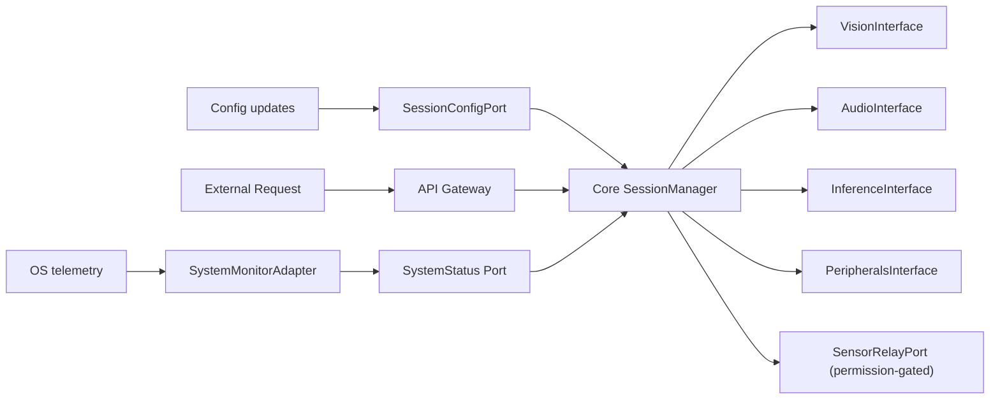

import { Aside } from '@astrojs/starlight/components';

## Overview

`core` is the central orchestrator that coordinates all domain crates. It is **entirely isolated** from the outside world and has **no knowledge** of V4L2, CPAL, RKNN, or any hardware-specific APIs.

## Ports & Adapters (Feature Flags)

<table>
  <thead>
    <tr>
      <th scope="col">Adapter</th>
      <th scope="col">Implements Port(s)</th>
      <th scope="col">Capability Feature</th>
      <th scope="col">Technology / Purpose</th>
    </tr>
  </thead>
  <tbody>
    <tr>
      <td><a href="#systemstatus-port--systemmonitoradapter"><code>SystemMonitorAdapter</code></a></td>
      <td><a href="#systemstatus-port--systemmonitoradapter"><code>SystemStatus</code></a></td>
      <td><code>core_sysinfo</code></td>
      <td>sysinfo → OS-level memory and CPU tracking</td>
    </tr>
    <tr>
      <td><a href="#systemstatus-port--systemmonitoradapter"><code>MockAdapter</code></a></td>
      <td><a href="#systemstatus-port--systemmonitoradapter"><code>SystemStatus</code></a></td>
      <td><code>core_mock</code></td>
      <td>Simulated system load for testing</td>
    </tr>
  </tbody>
</table>

<Aside type="note">
`core_sysinfo` and `core_mock` are capability features defined on the `core` crate. Profiles in `pai-engine` (such as `desktop`, `target`, and `test`) decide which of these capabilities are active for a given build. For a central overview of which capabilities are enabled in each profile, see the **Feature Flag Matrix** in [Workspace and Build](/architecture/workspace-and-build/#feature-flag-matrix-capabilities-vs-profiles).
</Aside>

## Architecture Context / Relationships

`core` depends heavily on **`common`**, which is a standalone crate providing logging, error types, CLI parsing, and the `ConfigProvider` and `PermissionManager` ports. Together, Core and Common form the hardware-agnostic "hexagon". The composition root (`pai-engine`) wires Common's adapters and injects them into Core. At the same time, `core` defines the interfaces (Ports) that all other domain crates (Vision, Audio, Inference, API, Peripherals) must implement as Driven or Driving Adapters.

## Crate Structure

`core` defines the interfaces (Ports) that other domain crates must implement. Following Rust Hexagonal Architecture best practices, these ports are defined within the Core's domain, while the Core's domain logic consumes them.

```text
crates/core/
├── src/
│   ├── domain/               # Core business logic (SessionManager, EventBus)
│   ├── flows/                # MVP state machine flows (Voice, Stream, etc.)
│   ├── ports/                # All Ports (Traits) defined by or consumed by Core
│   │   ├── device_control.rs # `DeviceControlPort` (Driving: privileged ops)
│   │   ├── inference.rs      # `InferenceInterface` (Driven) + `InferencePort` (Driving)
│   │   ├── sensor_relay.rs   # `SensorRelayPort` (Driving: external sensor relay)
│   │   ├── session_config.rs # `SessionConfigPort` (Driving: runtime config delivery)
│   │   ├── audio.rs          # `AudioInterface` (Driven)
│   │   ├── vision.rs         # `VisionInterface` (Driven)
│   │   └── peripherals.rs    # `PeripheralsInterface` (Driving)
│   └── adapters/             # Driving Adapters (e.g., `SystemMonitorAdapter`)
└── Cargo.toml
```

## The "Blind" Orchestrator (`core`)

The Core defines **interfaces (traits)** that describe what it needs, not how it's implemented. Adapters implement these traits and are injected at runtime.

### Core Interfaces

The Core defines two categories of interfaces:

**Domain Interfaces**: abstractions over engine subsystems (driven by the Core):

| Interface | Role | Purpose | Implemented By |
|-----------|------|---------|----------------|
| **VisionInterface** | Driven (outgoing) | Image acquisition and processing | `VisionManager` → adapters |
| **AudioInterface** | Driven (outgoing) | Audio capture and processing | `AudioController` → adapters |
| **InferenceInterface** | Driven (outgoing) | AI model execution | `InferenceController` → adapters |

**Capability Ports**: interfaces that external actors use to drive the Core. The API Gateway selects which of these ports a given adapter may access (see [Routing Matrix](/architecture/modules/api/#routing--authorization-matrix-defense-in-depth)):

| Port | Role | Purpose | Called By |
|------|------|---------|-----------|
| **DeviceControlPort** | Driving (incoming) | Privileged device operations (reboot, firmware update, factory reset). Restricted to local/IPC callers only. | `APIManager` (LocalSystem adapter only) |
| **SessionConfigPort** | Driving (incoming) | Runtime configuration updates (model paths, language, thresholds) pushed into the `SessionManager` without a restart | `APIManager`, `ConfigAdapter` (via `common`) |
| **SensorRelayPort** | Driving (incoming) | Session-level permission gate for external sensor relay requests; the `SessionManager` receives a "start relay" request and coordinates Vision/Audio to begin streaming to the caller | `APIManager` |
| **InferencePort** | Driving (incoming) | Standard AI workload requests (text generation, object detection) | `APIManager` (all adapters) |
| **PeripheralsInterface** | Driving (incoming) | HMI events and device feedback | Button handlers, display controllers |

### Dependency Injection

:::note
The code blocks and configuration examples in this document are conceptual references to better show the idea. The real code and structure might differ.
:::

We prefer **stack allocation** when concrete types are known at compile time (e.g. at the composition root). See [Rust Style and Best Practices](/guides/contributing/rust-style/) for the project rule: stack whenever possible without large maintainability cost.

**Preferred (generics, stack-allocated):** When the composition root wires one concrete type per build (e.g. via `#[cfg(feature = "...")]`), use generics so the orchestrator holds adapters on the stack:

```rust
// core: Orchestrator with generic type parameters (stack-allocated)
pub struct Orchestrator<V, A, I, Api, P, Cfg, Sr> {
    vision: V,
    audio: A,
    inference: I,
    api: Api,
    peripherals: P,
    session_config: Cfg,
    sensor_relay: Sr,
}

impl<V, A, I, Api, P, Cfg, Sr> Orchestrator<V, A, I, Api, P, Cfg, Sr>
where
    V: VisionInterface,
    A: AudioInterface,
    I: InferenceInterface,
    Api: APIInterface,
    P: PeripheralsInterface,
    Cfg: SessionConfigPort,
    Sr: SensorRelayPort,
{
    pub fn new(vision: V, audio: A, inference: I, api: Api, peripherals: P,
               session_config: Cfg, sensor_relay: Sr) -> Self {
        Self { vision, audio, inference, api, peripherals, session_config, sensor_relay }
    }
}
```

**Alternative (trait objects, heap):** Use `Box<dyn Trait>` when you need to choose the implementation at **runtime** or when many generic parameters would make the API unwieldy:

```rust
// Heap-allocated trait objects (use when runtime selection or simpler type signatures are needed)
pub struct Orchestrator {
    vision: Box<dyn VisionInterface>,
    audio: Box<dyn AudioInterface>,
    inference: Box<dyn InferenceInterface>,
    api: Box<dyn APIInterface>,
    peripherals: Box<dyn PeripheralsInterface>,
    session_config: Box<dyn SessionConfigPort>,
    sensor_relay: Box<dyn SensorRelayPort>,
}
```

The **Composition Root** ([`pai-engine/src/main.rs`](/architecture/composition-root/)) is the **only** place that knows which adapters are initialized and how they are selected (features, config). The Core does **not** know which modules or adapters are loaded; it only receives the injected interfaces and runs. For the full responsibility of main.rs (config load, adapter init, inject, run), see [Composition Root (main.rs)](/architecture/composition-root/). With generics, the root uses a type alias or concrete types so the compiler monomorphizes a single stack-allocated `Orchestrator` per build.

## Core Components & Internal Orchestration

All components that follow are **hardware-agnostic** and rely strictly on Hexagonal interfaces (traits).

### SessionManager (The Kernel)

The **absolute center** of the modular monolith:
- **Implements** `APIInterface` and `PeripheralsInterface`: handles incoming requests
- **Orchestrates** the driven interfaces: `VisionInterface`, `AudioInterface`, `InferenceInterface`
- Single entry point for both "driving" (user/API) and "driven" (sensor/inference) coordination

**State Machine:**

```rust
pub enum SessionState {
    Idle,
    Listening,      // Waiting for wake word or trigger
    Recording,      // Capturing audio/video
    Processing,     // Running inference
    Responding,     // Generating response
    Error,
}
```

The `EventBus` enables loose coupling: when Audio detects a wake word, it emits an event; SessionManager transitions to `Recording` and starts the appropriate flow.

#### User-Interruption & State Rollback

<Aside type="caution">
This is a **critical design requirement** for any voice- or audio-driven interaction. The system must allow a user to interrupt the current process mid-flow, by spoken word, button press, or any other trigger, and safely return the system to a clean, consistent state.
</Aside>

Without explicit interrupt and rollback handling, a cancelled operation can leave the system in a **"Zombie State"**: for example: microphone still open and streaming, but no listener active, or an NPU model loaded with no session consuming its output. This is both a resource leak and a correctness bug.

**Design requirements:**

- The `StateMachine` must define **valid cancel transitions** from any active state (`Recording`, `Processing`, `Responding`) back to `Idle` or `Listening`.
- Each multi-step flow (e.g., `Voice`: WakeWord → STT → LLM → TTS) must be implemented as a **Saga**: a sequence of compensating steps that undo partial work if any step is cancelled or fails.
- When an interrupt arrives (via `EventBus` or `PeripheralsInterface`), the `SessionManager` issues **compensating commands** in reverse order:
  1. Stop the current pipeline step (e.g., cancel TTS or stop LLM streaming).
  2. Release audio/video resources (stop microphone capture, release camera).
  3. Unload any transiently loaded inference models.
  4. Transition the `StateMachine` back to a safe state (`Idle` or `Listening`).

**Example: interrupted voice response**

```rust
// Simplified Saga-style compensating rollback in the Voice flow
match session_manager.interrupt_current_flow() {
    Ok(()) => {
        tts_adapter.stop_playback()?;         // Step 4 rollback
        inference.cancel_generation()?;       // Step 3 rollback
        audio.stop_capture()?;                // Step 2 rollback
        state_machine.transition(SessionState::Listening); // Step 1 rollback
    }
    Err(e) => state_machine.transition(SessionState::Error),
}
```

<Aside type="note">
The **Saga pattern** (borrowed from distributed systems design) is the recommended approach for multi-step flows. Each step in a flow registers a *compensating action*; if the flow is cancelled or aborts, the compensating actions are executed in reverse order. See the [Saga Design Pattern](https://newsletter.systemdesign.one/p/saga-design-pattern) for background.
</Aside>

### Internal Orchestration Modules

| Component | Responsibility |
|-----------|-----------------| 
| **StateMachine** | Global contextual state management (`Idle`, `Listening`, `Processing`, etc.). Blocks conflicting operations via invalid state transitions. **Owns the interrupt and rollback transitions**: any external interrupt triggers a safe, ordered state teardown. |
| **EventBus** | Asynchronous message broker. Decouples hardware interrupts (e.g., physical button press via `PeripheralsInterface`) from execution logic for non-blocking reactive programming. An interrupt signal is published here and consumed by the active Flow to trigger its Saga rollback. |
| **Scheduler** | Time-based or delayed operations (alarms, health checks, sleep state). Uses domain-defined time abstractions. |
| **SystemCommands** | Abstraction for privileged OS operations (reboot, factory reset). Only via `DeviceControlPort`; **not** exposed to network or MCP clients. |

### MVP Flows (`flows` module)

Hardcoded, deterministic business logic for the MVP:

| Sub-module | Responsibility |
|------------|-----------------| 
| **Interaction** | Physical UI events → session actions (e.g., "button short press" → start listening) |
| **Voice** | Voice-Assistant pipeline: Wake Word → STT → LLM → TTS |
| **Stream** | Continuous data pipelines (camera feed to Vision or MCP client) |
| **Chat** | Pure text-based REST requests (Ollama/OpenAI APIs) without audio feedback |

**FlowRunner Abstraction:** Rigid flow blocks are designed behind a `FlowRunner` trait. The Core depends on the trait, not concrete implementations. This decoupling is intentional and critical: it defines the path from today's static MVP flows to tomorrow's user-defined, personalised experiences.

```rust
pub trait FlowRunner: Send + Sync {
    fn execute(&self, flow_type: FlowType, context: &SessionContext) -> Result<FlowResult>;
}
```

#### Phase 1 (MVP): Static, Hardcoded Flows

In the MVP, `FlowRunner` is implemented by a concrete `HardcodedFlowRunner` that contains the built-in flows listed earlier (`Voice`, `Chat`, `Stream`, `Interaction`). These flows are:

- **Strongly-typed Rust**: fast to implement, zero runtime overhead
- **Fully testable**: no scripting engine, no runtime interpreter to mock
- **Deterministic**: every voice query follows the same WakeWord → STT → LLM → TTS pipeline

This is a deliberate architectural choice: *start simple, make the right abstraction, ship something that works.*

#### Phase 2 (Future): Dynamic, User-Defined Flows

The long-term product vision is that **users can define their own flows individually**: personalised AI behaviours without engineering involvement. Tracked in [GitHub Issue #38](https://github.com/aurintex/pai-os/issues/38). A user might define:

- *"When I say 'summarise', transcribe the last 5 minutes and email it"*
- *"When motion is detected at night, capture a snapshot and send a notification"*
- *"Run a custom interview prep session with a specific system prompt"*

This is enabled by the `FlowRunner` abstraction. In the future, the composition root injects a `ScriptedFlowAdapter` or `AgenticFlowAdapter` instead of the hardcoded one; `core` does not change at all:

```rust
// Phase 1 (MVP): wired in main.rs
let flow_runner = HardcodedFlowRunner::new();

// Phase 2 (Future): same interface, different implementation
let flow_runner = ScriptedFlowAdapter::new(rhai_engine, user_scripts_dir);
// or
let flow_runner = AgenticFlowAdapter::new(langgraph_runtime, user_graph);
```

**Candidate technologies for Phase 2:**
- **[Rhai](https://rhai.rs/)**: embedded scripting engine in pure Rust; sandboxed, safe, fast
- **LangGraph (via MCP)**: graph-based agentic flows managed on a host/desktop, executed remotely via MCP
- **JSON/YAML flow definitions**: a lightweight, no-code DSL that users edit in a companion app

<Aside type="note">
The hardcoded MVP flows are documented in [ADR-004: Engine Architecture](/architecture/adr/004-system-architecture/) (Hybrid Inference, Future Scope). The `FlowRunner` abstraction ensures these flows can evolve (from static to dynamic, from developer-defined to user-defined) without ever touching the Core's state machine or interfaces. See [ADR-004: Future Scope](/architecture/adr/004-system-architecture/#11-future-scope--deferred-features-yagni) for the deferred feature decision.
</Aside>

### SystemStatus (Port) & SystemMonitorAdapter

A dedicated **incoming (Driving)** port through which low-level Host OS telemetry is delivered directly into the Core, completely bypassing the API Gateway:
- Battery level changes, thermal throttling warnings, network interface state changes
- **Push-only into the Core**: the `SystemMonitorAdapter` fires events through this port; the Core never polls
- External API clients **cannot write** to this port; it is an internal, hardware-side entry point

**Who decides what to do with power/thermal events?**
The responsibility lies entirely with the **Core (`SessionManager` / `StateMachine`)**. The `SystemMonitorAdapter` only reports the raw fact (e.g. "battery at 12 percent"). It is the `SessionManager` and `StateMachine` that then react, for example:
- Trigger a "Battery Low" voice prompt via the Audio domain
- Disable large VLM / NPU workloads to reduce power draw
- Transition the `StateMachine` to a `LowPower` state
- Log a thermal throttling warning and gracefully reduce inference concurrency

A **Driving Adapter** that belongs directly to `core`'s infrastructure layer, bypassing the API Gateway:

- **Location:** Inside `core`, gated by `core_sysinfo`
- **Reads** hardware and OS state from Linux subsystems (`sysfs`, `upower`) via event-driven D-Bus/udev notifications (no polling)
- **Pushes** telemetry directly into the Core's `SystemStatus` Port
- The Core reacts autonomously: low-power state on critical battery, NPU throttling on thermal limits

<Aside type="note">
Because the SystemMonitorAdapter is part of Core's infrastructure, it is not subject to the API Gateway's port isolation matrix. It is a local, in-process adapter. On the Driving/Left side of the hexagon, it connects directly to the `SystemStatus` Port of the `SessionManager`.
</Aside>

### SessionConfigPort

A **Driving (incoming)** port through which runtime configuration changes are delivered into the `SessionManager` without requiring a full restart of the engine:

- **Push-based**: The `ConfigAdapter` (from `common`) observes config file changes or API-config commands and pushes validated `SessionConfig` structs through this port.
- **Allows live updates** for parameters such as: active wake-word model path, language, inference backend selection, and audio sensitivity thresholds.
- **Safety**: Config updates only take effect at a clean `Idle` state boundary; the `StateMachine` defers application of changes until the current flow is fully torn down, preventing mid-flow configuration drift.

```rust
pub trait SessionConfigPort: Send + Sync {
    /// Called when the config subsystem detects a validated config change.
    fn apply_config(&mut self, config: SessionConfig) -> Result<()>;
}
```

<Aside type="note">
`SessionConfigPort` receives its values **via the API Gateway** (`APIManager`) after they are validated, rate-limited and translated. External clients never push directly into the Core's config port; the API layer is the intermediary and validation boundary.
</Aside>

### SensorRelayPort

<Aside type="note">
**Does the Core need to own hardware here?** No. The `VisionManager` and `AudioManager` already own camera and microphone resources directly via their own adapters (v4l2r, cpal). `SensorRelayPort` is **not** a hardware-ownership mechanism; it is a **session-level coordination port**.
</Aside>

A **Driving (incoming)** port through which the `APIManager` forwards external sensor relay requests into the `SessionManager`. The `SessionManager` then decides whether to approve the request (based on current state and `PermissionManager` policy) and signals the Vision/Audio domains to begin streaming to the requesting caller:

- **Caller is an external client** (MCP agent, local service, gRPC client): it requests raw audio or video frames via the API Gateway.
- **Core is the permission and state gatekeeper**: The `SessionManager` checks current `StateMachine` state (e.g., only allow camera relay when in `Idle` or `Streaming` state) and evaluates the `PermissionManager` policy.
- **Vision/Audio do the actual streaming**: If approved, the Core instructs the relevant domain crate to push frames to the caller. The Core itself does not touch hardware.
- **Session-aware teardown**: If the session ends, the user interrupts, or a permission is revoked mid-relay, the `SessionManager` signals the relay to stop via the same port, coordinating cleanup across Vision/Audio without the caller needing to know.

```rust
pub trait SensorRelayPort: Send + Sync {
    /// External caller requests a sensor relay (e.g. live audio frames).
    fn request_relay(&mut self, caller_id: ClientId, kind: MediaKind) -> Result<()>;
    /// Core signals that an active relay must be terminated.
    fn terminate_relay(&mut self, caller_id: ClientId) -> Result<()>;
}
```

<Aside type="caution">
Hardware access isolation (ensuring external processes cannot open `/dev/video*` or ALSA directly) is enforced at the **OS level via udev rules**, not by this port. `SensorRelayPort` is purely a session-coordination interface. See [Security Architecture](/architecture/security/) and [OS & Infrastructure](/architecture/operating-system/) for the OS-level details.
</Aside>

## Production-Grade Robustness

The following patterns were identified as **critical for production reliability** in the architecture design phase. They must be enforced in the `SessionManager` and all `flows`:

### Idempotency

All session operations must be idempotent. If the user triggers `start_recording` twice (e.g., due to a double-tap or a network retry), the second call must return a success response ("Already Recording") without starting a second parallel capture. The `StateMachine` enforces this: an event that is invalid for the current state is silently acknowledged, not executed.

```rust
// StateMachine: idempotent guard
match (self.state, event) {
    (SessionState::Recording, SessionEvent::StartRecording) => {
        // Already recording: no-op, return Ok
        Ok(self.state)
    }
    // ...
}
```

### Backpressure & Queue Limits

When sensor data arrives faster than inference can consume it (e.g., camera at 60 FPS, NPU at 10 FPS), unbounded queues cause OOM crashes. All internal Tokio channels between the domain crates use **bounded capacities**:

- Vision frame queue: configurable bounded capacity (default: 5 frames); when full, old frames are dropped (ring-buffer semantics).
- Audio chunk queue: similarly bounded; over-full chunks are dropped silently; a gap in audio is preferable to an OOM crash.

This _backpressure_ design ensures the system degrades gracefully under load instead of accumulating unbounded memory.

### Saga Pattern for Multi-Step Flows

As described earlier in [User-Interruption & State Rollback](#sessionmanager-the-kernel), every multi-step flow (`Voice`, `Stream`, etc.) is structured as a **Saga**:

1. Each step registers a *compensating action* (rollback).
2. If any step fails **or an interrupt arrives**, all preceding steps' compensating actions are executed in reverse order.
3. The system is guaranteed to never end up in a Zombie State (resources leaked, state inconsistent).

This pattern ensures correctness for compound operations like:

- Start microphone → Start camera → Run inference → Generate response
- → *User interrupts* → **Rollback**: Stop response, cancel inference, release camera, close microphone, return to `Idle`.

<Aside type="note">
Saga/Rollback, Idempotency, and Backpressure are architectural patterns derived from distributed systems design (originally for cloud microservices), but they apply equally well to a **modular monolith** where modules communicate via in-process Tokio channels instead of network calls. See the [Modular Monolith](https://newsletter.systemdesign.one/p/modular-monolith), [Idempotent APIs](https://newsletter.systemdesign.one/p/idempotent-api), [Saga Design Pattern](https://newsletter.systemdesign.one/p/saga-design-pattern), and [Message Queues](https://newsletter.systemdesign.one/p/what-is-a-message-queue) references from the architecture design session.
</Aside>

## Data Flow



## Related Documentation

- [ADR-004: Engine Architecture](/architecture/adr/004-system-architecture/): Hexagonal Architecture, Modular Monolith
- [ADR-004: Engine Architecture](/architecture/adr/004-system-architecture/): MVP flows and voice pipeline
- [Common Module](/architecture/modules/common/): Shared foundation (ConfigProvider, PermissionManager) that Core depends on
- [Vision](/architecture/modules/vision/), [Audio](/architecture/modules/audio/), [Inference](/architecture/modules/inference/), [API](/architecture/modules/api/), [Peripherals](/architecture/modules/peripherals/): Domain modules implementing Core interfaces
- [Composition Root (main.rs)](/architecture/composition-root/): Bootstrap, adapter init, and injection (only place that knows which adapters exist)
- [Workspace and Build](/architecture/workspace-and-build/): Feature flags and crate layout
- [Security Architecture](/architecture/security/): PermissionManager, HITL workflow
