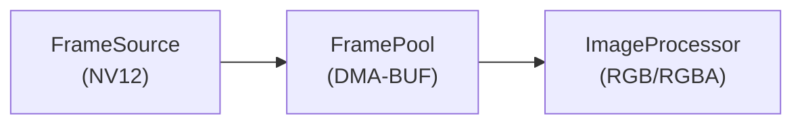

import { Aside } from '@astrojs/starlight/components';
import ExcalidrawViewer from '../../../../components/ExcalidrawViewer.astro';

The **Vision Module** handles the high-performance image acquisition and preprocessing pipeline. While our initial implementation leverages the specific hardware capabilities of the Rockchip RK3588 SoC (ISP, RGA), the module's architecture is entirely **vendor-agnostic**, allowing rapid porting to other SoCs while maintaining memory safety through Rust.

## Ports & Adapters (Feature Flags)

<table>
  <thead>
    <tr>
      <th scope="col">Adapter</th>
      <th scope="col">Implements Port(s)</th>
      <th scope="col">Capability Feature</th>
      <th scope="col">Technology / Purpose</th>
    </tr>
  </thead>
  <tbody>
    <tr>
      <td rowspan="2"><a href="#3-framesource-port--cameraadapter"><code>CameraAdapter</code></a></td>
      <td rowspan="2"><a href="#3-framesource-port--cameraadapter"><code>FrameSource</code></a></td>
      <td><code>vision_v4l2</code></td>
      <td>V4l2r → rkisp (MIPI-CSI) or USB Webcam</td>
    </tr>
    <tr>
      <td><code>vision_mock</code></td>
      <td>Simulated frames for CI testing</td>
    </tr>
    <tr>
      <td rowspan="3"><a href="#4-imageprocessor-port--imageprocessoradapter"><code>ImageProcessorAdapter</code></a></td>
      <td rowspan="3"><a href="#4-imageprocessor-port--imageprocessoradapter"><code>ImageProcessor</code></a></td>
      <td><code>vision_rga</code></td>
      <td>RGA (librga) → Radxa / Rockchip SoC 2D hardware acceleration</td>
    </tr>
    <tr>
      <td><code>vision_image</code></td>
      <td>image-rs → desktop CPU-based processing; also fallback on Radxa</td>
    </tr>
    <tr>
      <td><code>vision_mock</code></td>
      <td>Simulated image processing for CI</td>
    </tr>
    <tr>
      <td rowspan="3"><a href="#5-motiondetector-port--motionadapter"><code>MotionAdapter</code></a></td>
      <td rowspan="3"><a href="#5-motiondetector-port--motionadapter"><code>MotionDetector</code></a></td>
      <td><code>vision_isp_motion</code></td>
      <td>Hardware MD / V4L2 Stats → Rockchip SoC</td>
    </tr>
    <tr>
      <td><code>vision_cpu_motion</code></td>
      <td>image-rs → CPU frame diff (desktop fallback)</td>
    </tr>
    <tr>
      <td><code>vision_mock</code></td>
      <td>Simulated motion detection for CI</td>
    </tr>
  </tbody>
</table>

<Aside type="note">
The `Feature Flag` column shows **capability features defined on the `vision` crate** (e.g. `vision_v4l2`, `vision_image`, `vision_mock`). Which of these are actually enabled depends on the **profile features** defined in `pai-engine` (for example `desktop`, `target`, and `test`), which simply turn on sets of capabilities across all modules. For a single, up-to-date overview of which capabilities each profile enables, see the **Feature Flag Matrix** in [Workspace and Build](/architecture/workspace-and-build/#feature-flag-matrix-capabilities-vs-profiles).
</Aside>

## Architecture Context / Relationships

The Vision Module is the **reference implementation** of Hexagonal Architecture in pai-engine. It is driven by the `core` orchestrator. It is split into **domain** (logic + ports + types) and **adapters** (platform-specific implementations). The [system architecture diagram](/architecture/adr/004-system-architecture/) (and [C4 Architecture](/architecture/c4-architecture/)) shows the **Vision** block with the same ports (FrameSource, ImageProcessor, MotionDetector), adapters, and feature flags as on this page. See [Architecture Overview](/architecture/) and [ADR-004](/architecture/adr/004-system-architecture/) for context.

## Crate Structure

Like other domain crates, `vision` separates its internal domain logic from its hardware adapters.

```text
crates/vision/
├── src/
│   ├── domain/               # VisionManager, FramePool, StreamProfile
│   │   └── ports.rs          # Internal Traits: `FrameSource`, `ImageProcessor`
│   ├── adapters/             # Hardware implementations
│   │   ├── v4l2.rs           # `V4l2Adapter` for Linux cameras
│   │   ├── mock.rs           # Mock adapter for testing
│   │   └── rga.rs            # Rockchip RGA hardware acceleration
│   └── lib.rs                # Implements Core's `VisionInterface`
└── Cargo.toml
```

### Driven Sensor Philosophy

The camera is a **Driven Adapter** (right side of the Hexagon). It does **not** push frames and dictate the system tick. The Core's SessionManager requests or polls frames when needed. **Why:** Predictable resource use, simpler testing, alignment with the Hexagonal pattern. The **Orchestrator** (in `core`) calls into the Vision domain; Vision's **VisionManager** uses the ports, which are implemented by the adapters (Camera, RGA with Rockchip/x86/Mock).


## Internal Domain Components

The Vision Module consists of six core components, each with a specific responsibility:

### 1. StreamProfile (Configuration)

**Role:** Configuration & State Definition

**Description:** Deserializes the runtime configuration (JSON) into strict Rust structures. It defines the initial state of the pipeline, including resolution, framerate, and pixel formats (e.g., "Initialize 1080p stream @ 30fps").

**Responsibilities:**
- Parse and validate configuration from JSON
- Define pipeline state (resolution, framerate, pixel format)
- Provide type-safe configuration structures

### 2. FramePool (Memory Management)

**Role:** [DMA-BUF](/glossary/#d) Allocator

**Description:** Manages a pool of pre-allocated [DMA](/glossary/#d) buffers. This enables a zero-copy architecture where image data is shared directly between the Camera ISP and the RGA hardware without expensive CPU memory copies. The pool has a **fixed, bounded size**: if the frame consumer (Inference) cannot keep up with the capture rate, the oldest frames are evicted. This backpressure behaviour prevents memory exhaustion under load.

**Responsibilities:**
- Pre-allocate [DMA](/glossary/#d) buffers for zero-copy operations
- Manage buffer lifecycle (allocation, deallocation, recycling)
- Provide buffer access to FrameSource and ImageProcessor
- **Drop oldest frames** when the pool is full (ring-buffer semantics), preventing [OOM](/glossary/#o)

<Aside type="note">
[DMA-BUF](/glossary/#d) allows sharing memory between kernel drivers and user-space applications without copying data, critical for high-performance video processing.
</Aside>

### 3. FrameSource (Port) & CameraAdapter

**Role:** Port = trait in domain; Adapter = **CameraAdapter** (feature-gated: see [Ports & Adapters (Feature Flags)](#ports--adapters-feature-flags) table in this section).

**Description:** The domain defines a **FrameSource** port (start/stop stream, get frames). The **CameraAdapter** implements it: e.g. V4L2 for Linux (MIPI CSI on Rockchip, webcam on x86) and a Mock for tests.

**Responsibilities:**
- Domain: define the port interface (no hardware).
- Adapters: V4L2 lifecycle, NV12 frames, error handling; Mock for CI.
- Platform selection via `#[cfg(target_arch = "...")]` or similar in `adapters/mod.rs`.

### 4. ImageProcessor (Port) & ImageProcessorAdapter

**Role:** Port = trait in domain; Adapter = **ImageProcessorAdapter** (feature-gated: see [Ports & Adapters (Feature Flags)](#ports--adapters-feature-flags) table in this section).

**Description:** The domain defines an **ImageProcessor** port (format conversion, resize, crop). The **ImageProcessorAdapter** implements it: e.g. RGA on Radxa/Rockchip SoC, image-rs on desktop and as CPU fallback on Radxa, and Mock for CI.

**Responsibilities:**
- Domain: port interface only.
- Adapters: NV12→RGB, resize, crop; hardware-accelerated path on target, software path on desktop and as fallback.

<Aside type="tip">
The RGA unit can process images at up to 4K resolution with minimal CPU overhead, making it ideal for preprocessing frames before AI inference.
</Aside>

### 5. MotionDetector (Port) & MotionAdapter

**Role:** Port = trait in domain; Adapter = **MotionAdapter** (feature-gated: see [Ports & Adapters (Feature Flags)](#ports--adapters-feature-flags) table in this section).

**Description:** Motion gating for power saving. The ISP can output a **low-resolution thumbnail stream** (e.g., 64×64) alongside the full-resolution stream. The **MotionAdapter** implements the **MotionDetector** port: hardware thumbnail diff on target, CPU frame diff on desktop, and Mock for CI. The VisionManager uses motion detection to enable full-resolution capture and inference only when needed.

**Why this matters:** Full-resolution capture + RGA + inference consumes significant power. When a battery-powered [AI device](/glossary/#a) is idle (no motion detected), the system stays in a low-power state with only the ISP thumbnail stream active. Motion triggers the full pipeline.


### 6. VisionManager (Domain)

**Role:** Pipeline coordinator (domain logic).

**Description:** The central unit in the **domain**. It runs the event loop and orchestrates StreamProfile, FramePool, and the **ports** (FrameSource, ImageProcessor, MotionDetector). It has no hardware knowledge; adapters are injected (e.g. in `main.rs`).

**Responsibilities:**
- Coordinate data flow between domain types and ports
- Event loop and resource lifecycle
- Thread safety and cleanup


### Cancellation-Safe Interface (Saga Rollback Support)

`vision` is a **participant in Core's Saga rollback**. When the `SessionManager` cancels an in-progress flow (e.g., a user interrupts a visual query), it issues compensating commands to Vision. `VisionManager` **must** support clean cancellation at any point:

- `stop_stream()`: halts V4L2 capture, returns all FramePool buffers to the free-list, releases the camera device handle. Safe to call even if streaming was never started.
- `cancel_processing()`: signals any in-flight RGA operations to abort; does not block.

Failure to support these cleanly will leave the camera device open after the Core has moved back to `Idle`, blocking other processes and causing a Zombie State. See [Core: User-Interruption & State Rollback](/architecture/modules/core/#sessionmanager-the-kernel) for the full rollback sequence.

## Data Flow

### Internal pipeline (Vision domain)

Within the Vision domain crate, frames move through a fixed sequence. This ordering is **current design** and may remain hardcoded for simplicity; any future per-flow or user-configurable ordering would be an extension.



1. **FrameSource** (camera) retrieves ISP-processed frames (NV12).
2. **FramePool** provides [DMA](/glossary/#d) buffers for zero-copy transfer.
3. **ImageProcessor** converts NV12 to RGB/RGBA and performs any required resizing.

Processed frames are then **handed out** via the [VisionInterface](/architecture/modules/core/#core-interfaces) to the caller. The Vision domain does **not** decide what happens next.

### What happens after Vision: Core flows decide

**Whether** processed frames are passed to the [Inference](/architecture/modules/inference/) (or used for streaming, snapshots, or discarded) is **not** defined by the Vision domain. It is defined by the **active flow** in the [Core](/architecture/modules/core/): the `flows` component ([FlowRunner](/architecture/modules/core/#mvp-flows-flows-module), e.g. Voice, Stream, Chat, Interaction). The flow (and in future, the user or agent) decides if and when to call Inference, relay to a client, or drop the frame.

So the *final* end-to-end flow (e.g. Vision → Inference, or Vision → stream only) is always determined by the **flows** in Core; Vision only exposes the internal pipeline described earlier and implements the [VisionInterface](/architecture/modules/core/#core-interfaces).

## Hardware Integration

The Vision Module leverages specific RK3588 hardware:

| Component | Hardware | Purpose |
|-----------|----------|---------|
| **ISP** | Image Signal Processor | Camera sensor processing, auto-exposure, white balance |
| **RGA** | Raster Graphics Accelerator | Hardware-accelerated format conversion and scaling |
| **DMA** | [Direct Memory Access](/glossary/#d) | Zero-copy buffer sharing between components |

Motion gating (ISP thumbnail stream for power saving) is implemented by the [MotionDetector (Port) & MotionAdapter](#5-motiondetector-port--motionadapter) in the Internal Domain Components section.


## Related Documentation

- [ADR-004: Engine Architecture](/architecture/adr/004-system-architecture/): High-level architecture decisions
- [Inference Module](/architecture/modules/inference/): AI model execution (consumes vision frames)
- [Workspace and Build](/architecture/workspace-and-build/): Feature flags and build configuration
- [OS & Infrastructure](/architecture/operating-system/): System layer overview
- [C4 Architecture](/architecture/c4-architecture/): System context and containers
