import { Aside, Card, CardGrid, LinkCard } from '@astrojs/starlight/components';

This guide explains paiOS licensing in practical terms – what you can and cannot do.

## Repository Structure & Licenses

```
pai-os/
├── LICENSE              (AGPL-3.0 = default for everything)
├── NOTICE               (Copyright & Trademarks)
│
│   ✅ FREE TO USE (Apache-2.0)
├── api/                 ← All API definitions
│   └── grpc/
├── apps/                ← Your extensions go here
│
│   🔒 MUST SHARE CHANGES (AGPL-3.0)
├── engine/              ← Runtime code
├── os/
├── scripts/
└── docs/
```

<Aside type="tip" title="TL;DR for Extension Developers">
Put your extensions in `apps/` or use the `api/grpc/` API definitions – both are **Apache-2.0** licensed, so your code stays yours!
</Aside>

---

## Can I write proprietary extensions?

**Yes!** Extensions communicate with the paiOS runtime via gRPC over Unix Domain Sockets (IPC). This creates a clear process boundary, meaning:

- ✅ Your extension code is **not** a "derivative work" of the AGPL runtime
- ✅ You can license your extension however you want (proprietary, MIT, Apache, etc.)
- ✅ No requirement to share your extension source code

```mermaid
flowchart TB
    subgraph ext["✅ Your Extension"]
        ext_label["Any license you want!<br/>Proprietary, MIT, Apache, closed..."]
    end
    
    ext -->|"gRPC over UDS<br/>(License Boundary)"| runtime
    
    subgraph runtime["🔒 paiOS Runtime"]
        runtime_label["AGPL-3.0"]
    end
    
    style ext fill:#1a4d1a,stroke:#4ade80,color:#fff
    style ext_label fill:#1a4d1a,stroke:#4ade80,color:#fff
```



This follows the same pattern as:
- Linux kernel (GPL) + user applications (any license)
- Docker engine (Apache) + plugins (any license)

---

## What about the API?

The gRPC API definitions (`api/grpc/`) are licensed under **Apache-2.0**, which provides:

- ✅ Free use in commercial products
- ✅ Patent protection from contributors
- ✅ No copyleft – use it however you want

```protobuf
// SPDX-License-Identifier: Apache-2.0
// You can use this API in any project
service PaiService {
  rpc Infer(InferRequest) returns (InferResponse);
}
```

---

## What if I modify the runtime?

If you modify the **paiOS runtime itself** (the `engine/` code), the AGPL-3.0 requires you to:

1. **Share your changes** if you distribute the modified runtime
2. **Share your changes** if you offer the modified runtime as a network service

<Aside type="caution">
Modifying the runtime and keeping it closed is **not allowed** under AGPL-3.0 by default. If you need a commercial license for this, [contact us](mailto:info@aurintex.com).
</Aside>

---

## Shared Memory Constraints

If you need high-performance data transfer (e.g., camera frames, audio):

| ✅ Allowed | ❌ Not Allowed |
|-----------|---------------|
| Sharing raw byte buffers (JPEG, PCM audio) | Sharing complex paiOS data structures |
| gRPC handles pointing to shared buffers | Direct memory access to runtime internals |

<Aside type="note">
The [FSF considers](https://www.gnu.org/licenses/gpl-faq.html#GPLPlugins) shared memory with complex data structures as equivalent to "dynamic linking," which could trigger AGPL obligations. Stick to raw bytes and you're safe.
</Aside>

---

## For Developers & Partners

<CardGrid>
  <Card title="Build Extensions" icon="puzzle">
    Create proprietary extensions using our Apache-2.0 licensed API. No licensing fees, no source code sharing required.
  </Card>
  <Card title="Commercial Licensing" icon="star">
    Need a commercial license for runtime modifications or white-labeling? [Contact us](mailto:info@aurintex.com).
  </Card>
</CardGrid>

---

## Contributing

If you want to contribute to paiOS:

- Contributions to the runtime require signing our **CLA** (Contributor License Agreement)
- This grants aurintex the flexibility to ensure **long-term sustainability**
- You retain copyright to your contributions

<LinkCard
  title="Contributor License Agreement"
  description="Current contribution signing requirements"
  href="/guides/contributing/cla"
/>

---

## Background & Technical Details

For the full technical rationale behind our licensing decisions:

<LinkCard
  title="ADR-001: Licensing Strategy"
  description="Architecture Decision Record explaining our dual-license approach"
  href="/architecture/adr/001-licensing-strategy"
/>

---

## Questions?

- **Licensing inquiries**: info@aurintex.com
- **Technical questions**: Open a [GitHub Discussion](https://github.com/aurintex/pai-os/discussions)
